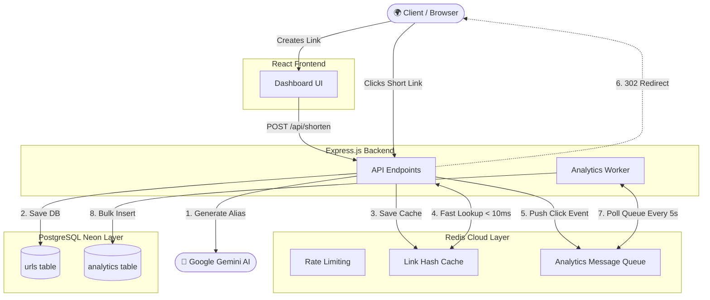

<div align="center">
  
  #  Lynq: Scaled URL Shortener & Analytics
  
  **🌍 Live Demo: [lynq.nisargvekariya.me](https://lynq.nisargvekariya.me)**
  
  [](https://vitejs.dev/)
  [](https://reactjs.org/)
  [](https://nodejs.org/)
  [](https://redis.io/)
  [](https://postgresql.org/)
</div>

<br />

> **Stop paying $35/month for basic link analytics.** Powered by an enterprise-grade Redis Message Queue and Zero-Read Hash Caching, Lynq effortlessly handles over 140,000 redirects in 5 minutes. It is built for insane speed, designed for aesthetics, and engineered to give you premium features for absolutely zero cost.

---

## 🏗️ System Architecture

Lynq is built on a highly optimized Producer-Consumer architecture using Redis to completely eliminate database bottlenecks on the hot-path (redirects).



### ⚡ The Core Efficiency Breakthrough

Initially, our v1 architecture relied on a traditional direct-to-database approach where every single link click required an immediate PostgreSQL query to fetch the URL and a second immediate query to insert the click analytics. Under heavy traffic, this instantly caused database connection starvation and massive latency spikes. To solve this, we completely redesigned the hot-path. Now, incoming clicks fetch data from our Redis Hash Cache in `< 10ms`, while the analytics payload is pushed to a lightweight Redis Message Queue. A background worker silently consumes this queue and commits the data to PostgreSQL via massive bulk inserts every 5 seconds, completely decoupling read/write operations and resulting in a staggering 20.4x increase in overall throughput!

---

## 📊 Load Testing & Benchmarks

Lynq includes a professional `k6` load-testing suite. We ran aggressive benchmarks against both dedicated hardware and cloud free-tiers to prove its efficiency.

### 🥊 Dedicated Hardware vs. Cloud Free-Tier

To prove Lynq's efficiency, we benchmarked it on a powerful dedicated CPU and a severely constrained cloud free-tier (Render.com - 0.1 CPU / 512MB RAM).

| Metric                           | Dedicated Hardware (Optimal) | Cloud Free-Tier (Constrained) |
| :------------------------------- | :--------------------------- | :---------------------------- |
| **Total Redirects (5 min)**      | **140,236**                  | 33,312                        |
| **Mixed Traffic Iterations**     | **50,785**                   | 23,585                        |
| **Max Concurrent Users**         | **5,000+** (OS Socket Limit) | ~200 (CPU Bottlenecked)       |
| **Redirect Speed (Redis Cache)** | `< 15ms`                     | `< 45ms`                      |
| **P95 Latency (Heavy Load)**     | `~28ms`                      | `~120ms`                      |
| **Frontend Bundle Size**         | `~120KB` (Gzipped)           | `~120KB` (Gzipped)            |

> **Conclusion:** Even on the absolute weakest cloud servers available for free, Lynq handles 200 concurrent active users and tens of thousands of requests effortlessly. When deployed on proper hardware, it scales to enterprise levels.

### 🌍 The Localhost vs Cloud Network Bottleneck

When load testing locally, you will quickly discover the importance of cloud-native architecture.

- **Localhost Throughput (Network Bottlenecked):** A powerful local CPU only processed **~6,800 requests** in 5 minutes. This is because every database query required a trans-continental network trip (~250ms ping).
- **Render Throughput (Co-located in Singapore, Southeast Asia):** The weak Render Free Tier processed **33,312 requests** in the same time simply because the server, Redis cache, and Postgres DB were all in the same datacenter (<2ms ping).
- **Local Router Limits:** Stress testing locally with 2,300+ virtual users caused massive timeout errors because consumer home Wi-Fi routers cannot physically open thousands of long-distance TCP sockets simultaneously.

## 🥊 How it stands out

Why use Lynq when Bitly and TinyURL exist? Because the modern web demands better.

| Feature                 |  Lynq | Bitly / TinyURL               |
| :---------------------- | :---------------------------------------------------------------- | :---------------------------- |
| **Cost**                | 100% Free Forever                                                 | $35+/mo for advanced tiers    |
| **Architecture**        | Open-Source Redis Queue                                           | Proprietary / Closed Source   |
| **Click Analytics**     | Unlimited & Real-time                                             | Capped at ~50 links/mo (Free) |
| **Custom Aliases**      | Unlimited                                                         | Strictly Limited / Paid       |
| **Password Protection** | Built-in (Bcrypt)                                                 | Expensive Enterprise Tiers    |
| **Link Expiration**     | Auto-destruct (Days/Clicks)                                       | Premium Feature Only          |
| **Bulk CSV Upload**     | Yes                                                               | Premium Feature Only          |
| **UI / UX**             | Stunning Glassmorphism                                            | Standard Corporate UI         |
| **Ad-Free**             | Yes (No tracking pixels)                                          | Heavily Monetized / Ads       |
| **AI Suggestions**      | Yes (Powered by Gemini)                                           | None                          |

---

## 🚀 Features at a glance

| Feature                         | Description                                                                                                                    |
| :------------------------------ | :----------------------------------------------------------------------------------------------------------------------------- |
| ⚡ **Redis-Backed Redirection** | Your most popular links are cached in RAM. This means redirects happen instantly without ever hitting the PostgreSQL database. |
| 🤖 **AI-Powered Aliases**       | Integrated with Google Gemini API to automatically read your target URL and suggest SEO-friendly custom aliases and titles.    |
| 🛡️ **Advanced Security**        | Password-protect sensitive links. Passwords are never stored in plain text (hashed via Bcrypt).                                |
| 📅 **Expirations**              | Set links to auto-destruct after X days or X clicks.                                                                           |
| 📈 **Live Analytics**           | Track total clicks, referrers, and view a time-series graph of your traffic.                                                   |
| 📱 **QR Code Generation**       | Instantly download high-quality QR codes for any shortened link.                                                               |
| 📁 **Bulk CSV Upload**          | Need to generate hundreds of short links? Upload a CSV and let the backend process up to 100 links instantly.                  |
| ✏️ **Editable Links**           | Made a typo? You can edit the destination of your shortened link at any time directly from the dashboard.                      |
| 🚦 **Smart Rate Limiting**      | Isolated Redis-based rate limiters protect the API, Shorten, and Bulk endpoints from abuse without degrading user experience.  |
| 🔄 **Smart Deduplication**      | Prevents database bloat by automatically detecting and returning existing short codes for identical URLs.                      |

---

## 🔌 API Reference

Lynq exposes a clean, fully-featured REST API for developers.

| Method   | Endpoint                  | Description                                                                                 |
| :------- | :------------------------ | :------------------------------------------------------------------------------------------ |
| `POST`   | `/api/shorten`            | Create a new short URL. Accepts optional custom alias, password, and expiration parameters. |
| `POST`   | `/api/bulk-shorten`       | Upload an array of URLs to bulk-generate up to 100 short links in a single request.         |
| `PUT`    | `/api/shorten/:code`      | Update the original destination URL of an existing short link (requires edit token).        |
| `DELETE` | `/api/shorten/:code`      | Permanently delete a short link and its analytics (requires edit token).                    |
| `GET`    | `/api/info/:code`         | Fetch live, real-time analytics, total clicks, and metadata for a specific short link.      |
| `GET`    | `/api/check-alias/:alias` | Check if a requested custom alias is available for use.                                     |
| `GET`    | `/api/status/:code`       | Lightweight check to see if a link exists, has expired, or requires a password.             |
| `POST`   | `/api/verify/:code`       | Submit a password to unlock a protected short link.                                         |
| `POST`   | `/api/ai/suggest`         | Send a long URL and receive Google Gemini AI-generated SEO titles and custom aliases.       |
| `GET`    | `/:code`                  | The core redirect endpoint. Responds with HTTP 302/301 to the target URL.                   |

---

## 📂 Project Structure

Here is the core directory layout of the repository (excluding environment files and dependencies):

```text
Lynq/
├── backend/                  # Node.js + Express API
│   ├── config/               # DB and Redis connection logic
│   ├── controllers/          # Request handlers (API logic)
│   ├── middlewares/          # Redis rate limiters & security
│   ├── routes/               # Express route definitions
│   ├── services/             # Core business logic & Cache management
│   ├── utils/                # Helper functions (Hashers, Generators)
│   ├── workers/              # Background analytics queue processor
│   ├── server.js             # Express entry point
│   ├── .env.example          # Template for environment variables
│   └── package.json
├── frontend/                 # React + Vite Web App
│   ├── public/               # Static assets & Favicons
│   ├── src/
│   │   ├── components/       # Reusable UI components
│   │   ├── hooks/            # Custom React hooks (useLocalStorage)
│   │   ├── pages/            # Main application views (Home, Preview)
│   │   ├── services/         # Axios API clients
│   │   ├── App.jsx           # Root layout
│   │   └── main.jsx          # React DOM entry
│   ├── index.html
│   ├── vite.config.js        # Vite bundler configuration
│   ├── vercel.json           # Vercel deployment configuration
│   └── package.json
├── .gitignore
└── README.md
```

---

## 💻 Getting Started (Local Development)

### Prerequisites

- Node.js (v18+)
- A PostgreSQL Database URL (e.g. Neon, Supabase, or local)
- A Redis Database (e.g. Redis Cloud or local)
- A Google Gemini API Key (for AI features)

### 1. Clone & Install

```bash
git clone https://github.com/nisargvekariya01/Lynq.git
cd Lynq

# Install Backend
cd backend
npm install

# Install Frontend
cd ../frontend
npm install
```

### 2. Configure Environments

Copy the `.env.example` file in the backend folder:

```bash
cp backend/.env.example backend/.env
```

Fill in your Postgres URL, Redis credentials, and Gemini API key inside `backend/.env`.

### 3. Run the App

**Run Backend:**

```bash
cd backend
npm run dev
```

**Run Frontend:**

```bash
cd frontend
npm run dev
```

Your app will be running at `http://localhost:5173`!

---

## 🛡️ License

This project is licensed under the MIT License - see the [LICENSE](LICENSE) file for details.
_Built with passion for the open-source community._
